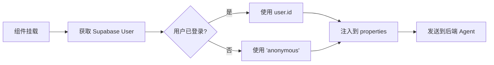

# CopilotProvider 使用指南

## 概述

`CopilotProvider` 是一个自定义的 CopilotKit 包装组件，支持：

- ✅ **自动用户身份注入**：从 Supabase Auth 获取当前用户 ID
- ✅ **动态更新**：监听认证状态变化，自动更新用户信息
- ✅ **优雅降级**：未登录用户使用 'anonymous' 标识
- ✅ **类型安全**：完整的 TypeScript 支持

## 快速开始

### 基础用法

```tsx
import { CopilotProvider } from "@/components/copilot-provider";

export default function RootLayout({ children }) {
  return (
    <CopilotProvider runtimeUrl="/api/copilotkit" agent="adk_demo">
      {children}
    </CopilotProvider>
  );
}
```

## 工作原理

### 用户身份流程



### 认证状态监听

组件会自动监听 Supabase 认证状态变化：

```typescript
// 用户登录
onAuthStateChange -> userId 更新为 user.id

// 用户登出
onAuthStateChange -> userId 更新为 null -> 'anonymous'
```

## 后端接收数据

### 在后端 Agent 中访问用户信息

后端通过 `RunAgentInput.forwarded_props` 接收：

```python
# backend/api/endpoint.py

def extract_user_id_from_forwarded_props(input: RunAgentInput) -> str:
    if isinstance(input.forwarded_props, dict):
        user_identity = input.forwarded_props.get("_user_identity", {})
        if user_id := user_identity.get("user_id"):
            return user_id

    return f"thread_user_{input.thread_id}"
```

### 数据结构

```python
# forwarded_props 结构
{
  "_user_identity": {
    "user_id": "550e8400-e29b-41d4-a716-446655440000"  # Supabase user ID
  }
}
```

## 扩展用法

### 添加更多用户属性

编辑 `components/copilot-provider.tsx`：

```typescript
const properties = {
  user_id: userId || 'anonymous',
  user_email: user?.email || null,          // 添加邮箱
  user_role: user?.role || 'guest',         // 添加角色
  user_metadata: user?.user_metadata || {}, // 添加元数据
};
```

### 条件渲染（可选）

如果需要在用户信息加载完成后再渲染：

```typescript
if (isLoading) {
  return (
    <div className="flex h-screen items-center justify-center">
      <p>Loading user session...</p>
    </div>
  );
}
```

### 自定义 Agent

```tsx
// 使用不同的 agent
<CopilotProvider
  runtimeUrl="/api/copilotkit"
  agent="smart_trader"  // 自定义 agent 名称
>
  {children}
</CopilotProvider>
```

## 调试

### 查看发送的 properties

在浏览器开发者工具中：

```javascript
// 1. 打开 Network 标签
// 2. 过滤 "copilotkit"
// 3. 查看 Request Payload
// 4. 找到 properties 字段

{
  "properties": {
    "user_id": "550e8400-e29b-41d4-a716-446655440000"
  }
}
```

### 后端日志

启用详细日志后，可以看到：

```
INFO - backend.api.endpoint - 🔍 ADK Agent: forwarded_props content: {'_user_identity': {'user_id': '550e8400-...'}}
INFO - backend.api.endpoint - ✅ ADK Agent: Successfully extracted user_id: 550e8400-...
```

## 常见问题

### Q: 用户 ID 为什么是 'anonymous'？

**可能原因**：
1. 用户未登录
2. Supabase client 配置错误
3. 环境变量未设置

**解决方案**：
```bash
# 检查 .env.local
NEXT_PUBLIC_SUPABASE_URL=your-supabase-url
NEXT_PUBLIC_SUPABASE_ANON_KEY=your-anon-key
```

### Q: 如何测试用户切换？

```typescript
// 在开发环境测试
const supabase = createClient();

// 登录
await supabase.auth.signInWithPassword({
  email: 'test@example.com',
  password: 'password',
});

// 登出
await supabase.auth.signOut();

// CopilotProvider 会自动更新 userId
```

### Q: 性能影响如何？

- ✅ **轻量级**：仅在组件挂载时调用一次 `getUser()`
- ✅ **高效监听**：使用 Supabase 的订阅机制，无轮询
- ✅ **无阻塞**：不会影响页面渲染（可选启用 loading 状态）

## 安全考虑

### 客户端安全

```typescript
// ✅ 安全：仅发送用户 ID
properties: {
  user_id: userId,
}

// ❌ 避免：发送敏感信息
properties: {
  user_password: '...',      // 永远不要发送密码
  user_api_key: '...',       // 不要发送密钥
}
```

### 后端验证

```python
# 后端应该验证用户身份
def extract_user_id_from_forwarded_props(input: RunAgentInput) -> str:
    user_id = input.forwarded_props.get("_user_identity", {}).get("user_id")

    # TODO: 验证 user_id 是否有效
    # TODO: 验证 user_id 是否有权限执行操作

    return user_id
```

## API 参考

### CopilotProvider Props

| Prop | 类型 | 必需 | 描述 |
|------|------|------|------|
| `children` | `ReactNode` | ✅ | 子组件 |
| `runtimeUrl` | `string` | ✅ | CopilotKit 运行时 URL |
| `agent` | `string` | ✅ | Agent 名称 |

### 自动注入的 Properties

| 属性 | 类型 | 值 |
|------|------|-----|
| `user_id` | `string` | Supabase user ID 或 'anonymous' |

## 最佳实践

### ✅ 推荐

```typescript
// 1. 使用环境变量配置
const RUNTIME_URL = process.env.NEXT_PUBLIC_COPILOT_RUNTIME_URL || '/api/copilotkit';

<CopilotProvider runtimeUrl={RUNTIME_URL} agent="adk_demo">
  {children}
</CopilotProvider>

// 2. 在后端验证用户权限
// 3. 不要在 properties 中发送敏感信息
// 4. 使用 TypeScript 确保类型安全
```

### ❌ 避免

```typescript
// 1. 不要硬编码敏感信息
<CopilotProvider properties={{ api_key: 'secret' }}>  // ❌

// 2. 不要绕过认证
<CopilotProvider properties={{ user_id: 'admin' }}>  // ❌

// 3. 不要发送过多数据
<CopilotProvider properties={{ entire_user_object: user }}>  // ❌
```

## 相关资源

- [CopilotKit 官方文档](https://docs.copilotkit.ai)
- [Supabase Auth 文档](https://supabase.com/docs/guides/auth)
- [后端日志配置](../backend/config/README_LOGGING.md)
